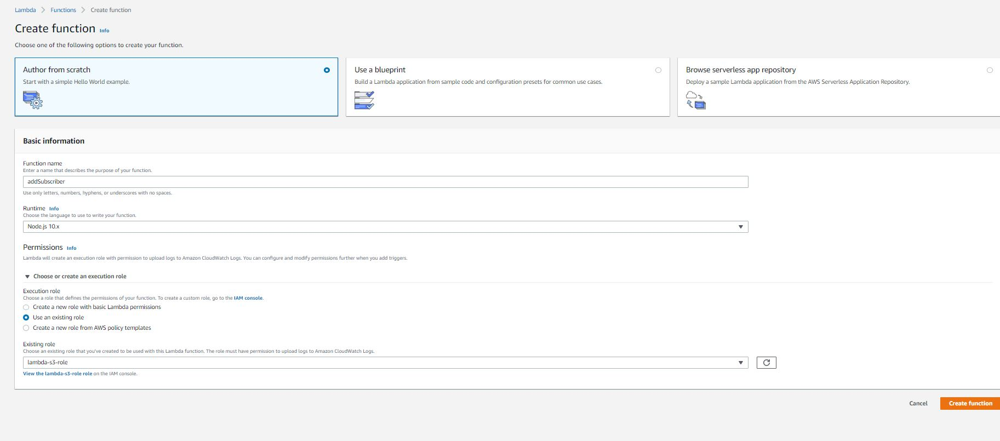
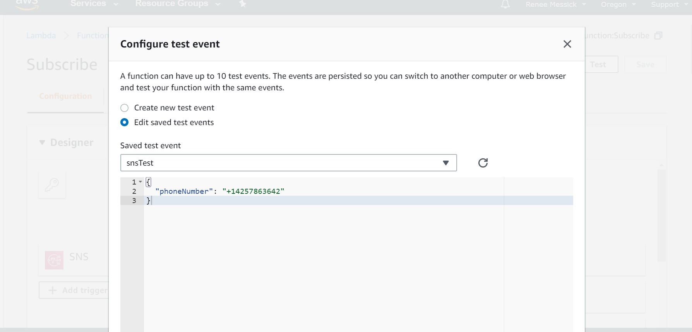

# snsLambdaTaskComplete

### Create an SNS Topic
* Name this topic "TaskComplete"
* Description such as "Completed Task Notifications"

#### Create a Lambda function that creates a subscriber
* The lambda function should take in a phone number as the event parameter
* This phone number should be registered as an "SMS" subscriber to your topic

#### Create a Lambda function that triggers a notification
* This lambda function should publish a message to your topic
* Once published, SNS should then send a text message to the the subscriber you created in the previous step

## Resources

https://docs.aws.amazon.com/sns/latest/dg/sns-tutorial-create-topic.html

https://docs.aws.amazon.com/sns/latest/dg/sns-lambda-as-subscriber.html

## Collaborators

- @Bombibear
- Sapana Poudel
- Nhu Trinh
- Joachen Busch
- Brandon Hurrington
- Travis Cox
- Jack Kinne
- Marisha Hoza
- Chris Coulon
- Matt Stuhring
- Melfi Perez
- Padmapriva Ganapathi